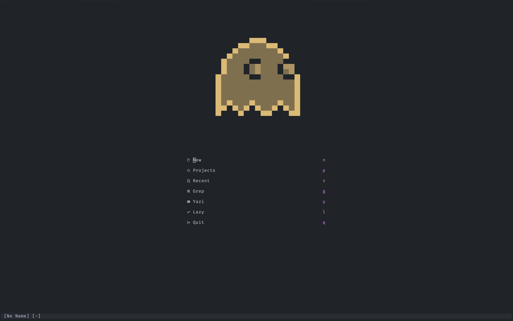

# dotfiles 🍩

These are my personal dotfiles. The setup is based on
[dotbot](https://github.com/danydodson/dotfiles) and aims to be as idempotent as
possible.

### Systems 🚀

- [macOS](docs/macos.md)

### Neovim ⌨️

- [nvim](installers/nvim.sh)

### Git 🐙

- [Configure git](docs/git.md)

### Project config/tooling 🧢

- [Configure projects](installers)
- [Local commands](bin/)

### Fonts 💯

- [Operator Mono](https://typography.com/blog/introducing-operator)
- [FiraCode Nerd Font Mono](https://github.com/ryanoasis/nerd-fonts/tree/master/patched-fonts/FiraCode)
- [Iconic Fonts](https://github.com/mdSlash/iconic-fonts)
- [Nerd Font](https://github.com/ryanoasis/nerd-fonts)

### Ansi art 🎨

1. Go to [image-to-ansi](https://dom111.github.io/image-to-ansi) ([github repo](https://github.com/dom111/image-to-ansi)).
2. Upload image.
3. Enable true colors, set width to 46.